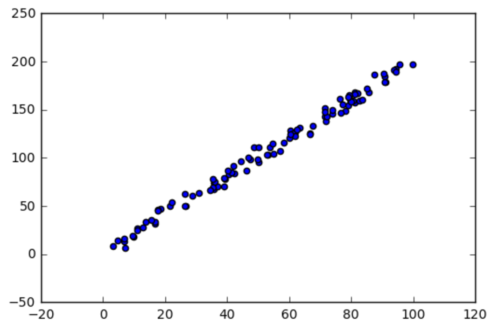

# Linear Regression
short exercises for learning linear regression

```python
import numpy as np
import matplotlib.pyplot as plt

#load that data
X = []
Y = []
for line in open('data_1d.csv'):
    x,y = line.split(',')
    X.append(float(x))
    Y.append(float(y))

# turn X and Y into numpy array
X = np.array(X)
Y = np.array(Y)

plt.scatter(X,Y)
plt.show()
```

