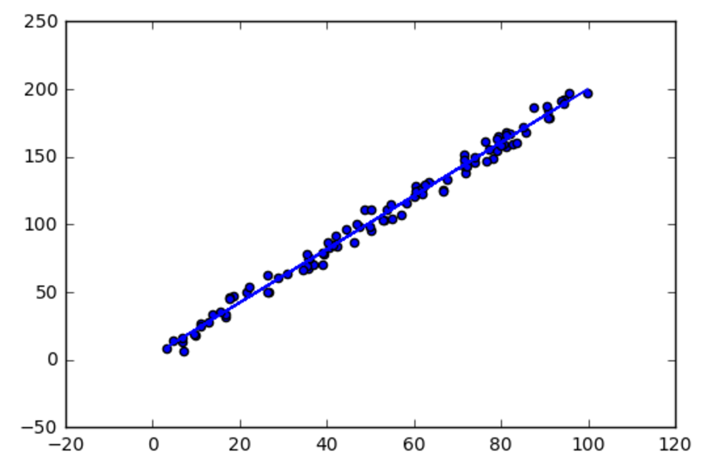

# Linear Regression
short exercises for learning linear regression

```python
import numpy as np
import matplotlib.pyplot as plt

#load that data
X = []
Y = []
for line in open('data_1d.csv'):
    x,y = line.split(',')
    X.append(float(x))
    Y.append(float(y))

# turn X and Y into numpy array
X = np.array(X)
Y = np.array(Y)

plt.scatter(X,Y)
plt.show()
```

```python
# apply the equeations we learned to calculate a and b
denominator = X.dot(X) - X.mean() * X.sum()
a = (X.dot(Y) - Y.mean() * X.sum()) / denominator
b = (Y.mean() * X.dot(X) - X.mean() * X.dot(Y)) / denominator

# calculated predicted Y
Yhat = a * X + b

# plot it all
plt.scatter(X, Y)
plt.plot(X, Yhat)
plt.show()
```


```python
# calculate r-squared
d1 = Y - Yhat
d2 = Y - Y.mean()
r2 = 1 - d1.dot(d1) / d2.dot(d2)
print "the r-squared is", r2
```
```
the r-squared is 0.991183820298
```

##Moore's Law
```python
import re
import numpy as np
import matplotlib.pyplot as plt

X = []
Y = []

non_decimal = re.compile(r'[^\d]+')

for line in open('moore.csv'):
    r = line.split('\t')
    
    x = int(non_decimal.sub('', r[2].split('[')[0]))
    y = int(non_decimal.sub('', r[1].split('[')[0]))
    X.append(x)
    Y.append(y)

X = np.array(X)
Y = np.array(Y)

plt.scatter(X,Y)
plt.show()
```

```python
Y = np.log(Y)
plt.scatter(X,Y)
plt.show()
```

```python
denominator = X.dot(X) - X.mean() * X.sum()
a = ( X.dot(Y) - Y.mean() * X.sum() ) / denominator
b = ( Y.mean() * X.dot(X) - X.mean() * X.dot(Y) ) / denominator

Yhat = a * X + b

plt.scatter(X,Y)
plt.plot(X, Yhat)
plt.show()
```

```python
d1 = Y - Yhat
d2 = Y - Y.mean()
r2 = 1 - d1.dot(d1) / d2.dot(d2)

print("a:", a, "b:", b)
print("the r-squared is:", r2)

print("Time to double", np.log(2)/a, "years")
```
```
('a:', 0.3510435733650199, 'b:', -685.00028438170898)
('the r-squared is:', 0.95294428522857599)
('Time to double', 1.9745331723797188, 'years')
```
